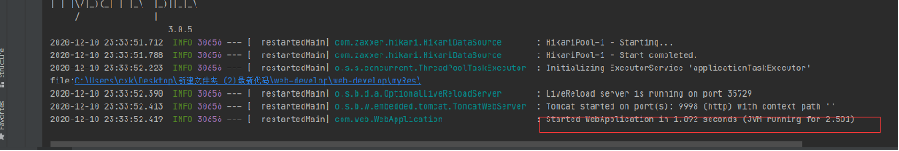

# Front-end-design-of-summon-system

> 这里由于本人负责的是前端设计部分，所以这里的代码我只是上传前端部分，后端部分的如果有需求可以参考码云上[链接](https://gitee.com/chenxiankong/web-develop)
>
> 实现具体要求可以参考项目结构中的`召集令系统任务需求.pdf`这个文件

## 前端设计

- 语言：JavaScript
- 框架选择：Vue
- 组件库：ElementUI、Echarts
- 关键技术：Vuex、axios、session等
- IDE：Visual Studio Code | MacOS
- 访问地址：127.0.0.1:8080

## 后端设计

- 语言：Java

- 框架选择：Springboot  Mybatis-Plus

- 关键技术：Redis Jwt

- IDE：IDEA | Windows10

- 数据库：MySQL5.7 Redis6.0 

- 数据库备份导出文件名称：web-sql.sql

- API基地址：127.0.0.1:9998

  > API接口说明全在：[MOCK](https://mock.yonyoucloud.com/project/15879/interface/api)，没权限？你们好像看不了？不想折腾了:cry:

## 其他说明情况

- 管理员用户名、密码：admin admin

- 可测试的一个普通用户名、密码：test 123123

- 后端关键配置文件名称及路径参见码云[链接](#1)

  1) 后端Springboot运行环境：工程src/main/resources/application-dev.yml

  2) 后端数据库文件：工程目录sql.txt

- JDK版本：1.8.0_271

- Mysql版本：5.7

- Redis版本：6.0

- Springboot 版本：2.3.4.RELEASE

- Node.js版本: 6.14.8

## 运行说明

> **如果只是想看看效果的话只需要安装mysql就可以了，注意一下版本信息5.7的，然后注意mysql的用户名和密码默认设为`root`和`123456`，另外建库sql文件在`back_end`文件夹中的`web-sql.sql`中**

- **运行后端**：进图back_end文件夹，`java -jar demo.jar`即可

  - [ ] 如果想了解源代码，可以从[码云](https://gitee.com/chenxiankong/web-develop)上拉取，使用Idea打开文件夹web-develop，等待依赖加载完毕，点击运行

    > 注：这个除了需要安装`mysql`之后还需要`redis`

  

  

- **运行前端**：在前端工程文件夹``front_end`打开cmd窗口，先使用`npm install`命令安装相关依赖，再使用`npm run serve`命令启动工程。显示如下界面即前端工程运行成功

  

- 访问界面：[**http://localhost:8080/**](http://localhost:8080/)

  

## 实现功能说明

|  编号  |       功能点说明       |                         前端关键页面                         |                         工程实现对应                         |
| :--: | :--------------------: | :----------------------------------------------------------: | :----------------------------------------------------------: |
|  1  |      用户注册功能      |            front_end/src/components/Register.vue             |            com/web/controller/UserController.java            |
|  2   |      用户登录功能      |              front_end/src/components/Login.vue              |            com/web/controller/UserController.java            |
|  3   |    用户信息管理模块    |              front_end/src/components/Info.vue               |            com/web/controller/UserController.java            |
|  4   | 召集令信息查询功能模块 |          front_end/src/components/CheckConvene.vue           |          com/web/controller/CallFindController.java          |
|  5   |    我是令主功能模块    | front_end/src/components/release_convene/Convene.vue  front_end/src/components/release_convene/Myconvene.vue | com/web/controller/CallFindController.java  com/web/controller/CallModifyController.java |
|  6   |    我要接令功能模块    | front_end/src/components/accept_convene/Accept.vue  front_end/src/components/accept_convene/AcceptList.vue | com/web/controller/RequestFindController.java  com/web/controller/RequestModifyController.java |
|  7   |    统计分析功能模块    |            front_end/src/components/CheckFee.vue             | com/web/controller/SucceedFindController.java  com/web/controller/IncomeController.java |

## 关键界面截图

### 1. 注册界面

### 2. 登录界面

### 3. 管理员查看所有用户信息

### 4. 管理员查看所有召集令信息

### 5. 管理员查看所有接令信息

### 6. 统计分析模块页面

### 7. 用户信息管理模块

### 8. 我是令主功能模块

#### 8.1 发布召集令

#### 8.2 所有已发布的召集令信息

### 9. 我要接令功能模块

#### 9.1 申请接令页面

##### 展示所有信息

#### 查看召集令信息

##### 填写申请信息

#### 9.2 接令列表页面

